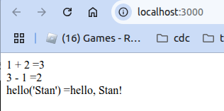

## ab-as-import-fn
- First attempt write and run wasm generated by assemblyscript tool chain.
- src = https://www.assemblyscript.org/
- src = https://www.assemblyscript.org/getting-started.html#working-with-your-module
- src = https://blog.ttulka.com/learning-webassembly-9-assemblyscript-basics/

#### Import custom fn from assemblyscript/wasm to javascript. 
- This example shows how to define and import a fn in assembly script, compile to wasm, then import the wasm and import the fn to js.

```bash
cd ab-as-import-fn/
npm install
npm run asbuild       # generates the files in ./build/ (./build/release.js and ./build/release.wasm)
npm run start         # serve the index.html that uses ./build/release.js and ./build/release.wasm 
http://localhost:3000

# prints the following to a webpage (see image below)
  1 + 2 =3
  3 - 1 =2
  hello('Stan') =hello, Stan!

#### explanation of project file-structure

```



```
ab-as-import-fn/
├── asconfig.json              // config file for assemblyscript (generated by npm asinit .)
├── assembly
│     ├── index.ts             // assemblyscript file
│     └── tsconfig.json        // typescript config
├── index.html                 // index.html -- contains js that uses ./build/release.wasm
├── node_modules/
│     ├── assemblyscript/
│     ├── binaryen/
│     └── long/
├── package.json
├── package-lock.json
└── tests
    └── index.js

```

#### running tests

```bash
# here`s the command to run the tests defined in ./tests/index.js
npm run test

  # sample output
  > ab-as-import-fn@1.0.0 test
  > node tests
  
  add passed
  subtract passed
  hello passed
  ok


```